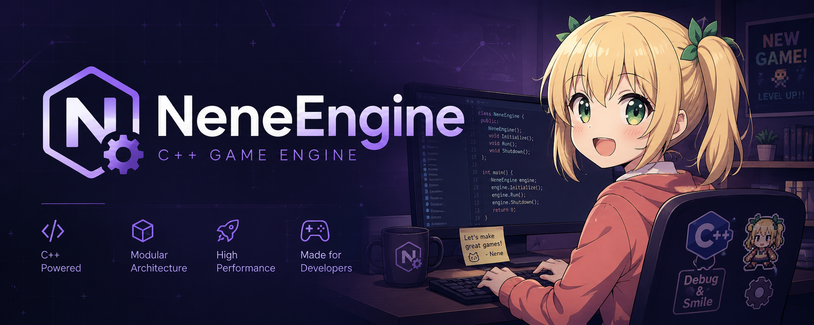

**A lightweight, modern C++20 game engine** focused on clean architecture, ECS, and rapid prototyping.
-----------------

NeneEngine is an experimental game engine built with modern C++ practices by BennySpace (Vlasov Daniil) and Wesdmond (Timofey Shabanov). It features an Entity-Component-System (EnTT), a flexible game state machine, data-driven scene serialization in JSON, and DirectX 12 rendering through Diligent Engine.

### Key Features
- Win32 multi-window application framework with per-window input focus
- DirectX 12 renderer powered by Diligent Engine
- ECS architecture based on EnTT with gameplay, camera, primitive control, and render systems
- Game state machine with Play / Pause / Menu flow
- JSON-based engine and scene configuration
- Scene serialization and loading from JSON
- Runtime hot-reload for background color via `assets/config/engine.json` with window layout changes applied on next launch
- Hierarchical transforms with parent-child scene relationships
- Built-in primitive rendering for Line, Triangle, Quad, and Cube entities
- Assimp-based mesh loading pipeline with ResourceManager integration
- GPU mesh upload path with indexed rendering for loaded meshes
- Free-look camera controller with mouse, WASD movement, and Shift acceleration
- Interactive test primitive controls for movement, scaling, and rotation
- Async logging with spdlog

### Build

Requirements:
- Windows
- Visual Studio with MSVC toolchain
- CMake 3.19+
- Ninja
- `VCPKG_ROOT` configured for vcpkg integration

Configure and build:

```bash
cmake --preset x64-debug
cmake --build out/build/x64-debug --config Debug
```

Release build:

```bash
cmake --preset x64-release
cmake --build out/build/x64-release --config Release
```

### Licenses

- Project license: [LICENSE.txt](LICENSE.txt)
- Third-party notices: [THIRD_PARTY_NOTICES.txt](THIRD_PARTY_NOTICES.txt)

---

Built with care for clean code and game programming patterns.
